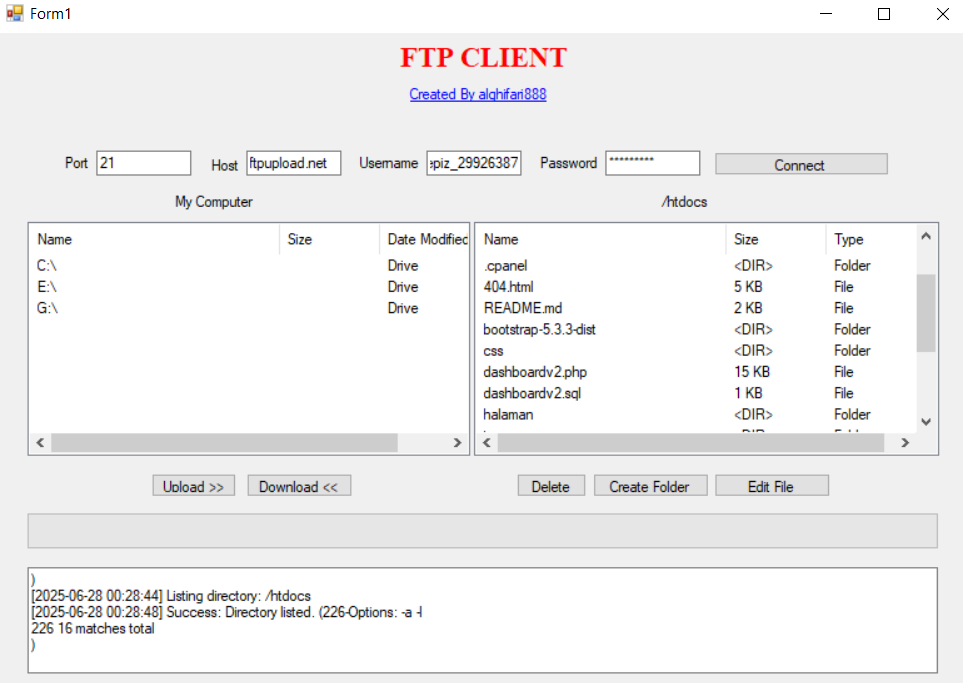
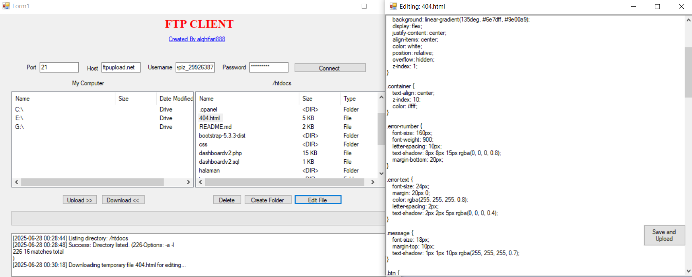

# 📂 FTP Client Sederhana (VB.NET)

Selamat datang di dokumentasi resmi **Proyek FTP Client Sederhana**. Aplikasi ini merupakan klien FTP desktop berbasis **Visual Basic .NET (VB.NET)** dan **Windows Forms** yang dirancang untuk tujuan edukasi sekaligus sebagai fondasi pemahaman komunikasi dengan server FTP.


> ✨ _"Aku tidak berilmu; yang berilmu hanyalah DIA. Jika tampak ilmu dariku, itu hanyalah pantulan dari Cahaya-Nya."_





## 📜 Daftar Isi
1. [Fitur Utama](#-fitur-utama)
2. [Teknologi yang Digunakan](#-teknologi-yang-digunakan)
3. [Panduan Instalasi](#-panduan-instalasi)
4. [Struktur Folder & File](#-struktur-folder--file)
5. [Panduan Penggunaan](#-panduan-penggunaan)
6. [Konsep Teknis Utama](#-konsep-teknis-utama)
7. [Panduan Kontribusi](#-panduan-kontribusi)


## ✨ Fitur Utama
Aplikasi ini menyediakan berbagai fitur esensial untuk operasi FTP dasar:

### Koneksi
- 🌐 **Koneksi FTP Standar**  
  Mendukung koneksi dengan Host, Port, Username, dan Password

### Manajemen File
- ↔️ **Tampilan Dua Panel**  
  Menampilkan file lokal dan server secara berdampingan
- 📁 **Navigasi Direktori**  
  Mendukung penjelajahan folder dan sub-folder
- 🔼 **Upload File**  
  Mengunggah file dari lokal ke server
- 🔽 **Download File**  
  Mengunduh file dari server ke lokal
- 🗑️ **Hapus File/Folder**  
  Menghapus file atau folder di server
- 📂 **Buat Folder Baru**  
  Membuat direktori baru di server

### Fitur Tambahan
- ✍️ **Edit File Langsung**  
  Memungkinkan editing file teks langsung di server
- 📊 **Indikator Proses**  
  Menampilkan progress bar untuk operasi transfer
- 📜 **Log Aktivitas**  
  Mencatat semua aktivitas dan status koneksi


## 🚀 Teknologi yang Digunakan
- **Bahasa Pemrograman:** Visual Basic .NET (VB.NET)
- **Antarmuka Pengguna:** Windows Forms (WinForms)
- **Framework:** .NET Framework 4.x
- **Library FTP:** `System.Net.FtpWebRequest`
- **IDE Pengembangan:** Microsoft Visual Studio


## 🚀 Panduan Instalasi

### 🔧 Persyaratan Sistem
- Microsoft Visual Studio (2017 atau versi lebih baru)
- .NET Framework 4.7.2 atau lebih tinggi

### 📦 Langkah-langkah Instalasi
1. Clone repository:
   ```bash
   git clone https://github.com/Alghifari888/FtpClient
   ```
2. Buka solusi di Visual Studio:
   - Buka file `.sln`
3. Build proyek:
   - Pilih Build > Build Solution (atau tekan `F6`)
4. Jalankan aplikasi:
   - Tekan F5 atau buka file `.exe` di `bin/Debug/`

---

## 📁 Struktur Folder & File
Berikut struktur utama proyek:

```
VbFtpClient/
├── My Project/          # Konfigurasi aplikasi
│   ├── Application.myapp
│   ├── AssemblyInfo.vb
│   ├── Resources.resx
│   └── Settings.settings
├── bin/                 # Output build
│   └── Debug/
│       └── VbFtpClient.exe
├── obj/                 # File objek build
├── App.config           # Konfigurasi aplikasi
├── Form1.vb             # Form utama
├── Form1.Designer.vb    # Desainer form utama
├── frmEditor.vb         # Editor teks
├── frmEditor.Designer.vb # Desainer editor
└── VbFtpClient.vbproj   # File proyek
```

---

## 📖 Panduan Penggunaan

### Langkah Dasar
1. Jalankan aplikasi (F5 atau file `.exe`)
2. Masukkan detail koneksi:
   - **Host:** ftp.domain.com
   - **Port:** 21 (default)
   - **Username & Password**
3. Klik `Connect` untuk memulai

### Tabel Operasi
| Aksi        | Cara Penggunaan                          |
| ----------- | ---------------------------------------- |
| Upload      | Pilih file lokal → klik `Upload >>`      |
| Download    | Pilih file server → klik `<< Download`   |
| Edit File   | Pilih file teks → klik `Edit File`       |
| Buat Folder | Klik `New Folder` → masukkan nama folder |
| Hapus       | Pilih item → klik `Delete`               |


## 🧠 Konsep Teknis Utama

### 1. Pemrograman Asinkron
Menggunakan `Async/Await` untuk menjaga responsivitas UI selama operasi FTP

### 2. Kelas FtpWebRequest
Implementasi utama untuk operasi FTP:

| Fungsi      | Method                  |
| ----------- | ----------------------- |
| List file   | `ListDirectoryDetails`  |
| Upload      | `UploadFile`            |
| Download    | `DownloadFile`          |
| Hapus       | `DeleteFile`            |
| Buat folder | `MakeDirectory`         |

### 3. Thread-Safe UI Updates
Menggunakan `InvokeRequired` dan `Invoke()` untuk update UI yang aman


## 📣 Panduan Kontribusi

### Untuk Kolaborator
1. Clone repository:
   ```bash
   git clone https://github.com/Alghifari888/FtpClient
   ```
2. Buat branch baru:
   ```bash
   git checkout -b fitur/nama-fitur-baru
   ```
3. Lakukan perubahan dan commit:
   ```bash
   git add .
   git commit -m "feat: Menambahkan fitur baru"
   ```
4. Push ke repository:
   ```bash
   git push origin fitur/nama-fitur-baru
   ```
5. Buat Pull Request ke branch `main`

### Untuk Kontributor Eksternal
1. Fork repository terlebih dahulu
2. Ikuti langkah yang sama seperti untuk kolaborator
3. Buat Pull Request dari fork Anda ke repository utama

### Pedoman Kontribusi
- Gunakan konvensi penamaan yang konsisten
- Format pesan commit:
  - `feat:` untuk fitur baru
  - `fix:` untuk perbaikan bug
  - `docs:` untuk perubahan dokumentasi
  - `style:` untuk perubahan format
  - `refactor:` untuk perbaikan kode tanpa perubahan fungsionalitas
- Satu Pull Request per fitur/perbaikan


## 🙏 Ucapan Terima Kasih
Terima kasih atas ketertarikan dan kontribusi Anda! Mari bersama-sama membangun komunitas open source yang lebih baik di Indonesia.


## 📄 License (English)

This project is licensed under the MIT License.

Permission is hereby granted, free of charge, to any person obtaining a copy
of this software and associated documentation files (the "Software"), to deal
in the Software without restriction, including without limitation the rights
to use, copy, modify, merge, publish, distribute, sublicense, and/or sell
copies of the Software, subject to the following conditions:

The above copyright notice and this permission notice shall be included in all
copies or substantial portions of the Software.

THE SOFTWARE IS PROVIDED "AS IS", WITHOUT WARRANTY OF ANY KIND, EXPRESS OR
IMPLIED, INCLUDING BUT NOT LIMITED TO THE WARRANTIES OF MERCHANTABILITY,
FITNESS FOR A PARTICULAR PURPOSE AND NONINFRINGEMENT.

---

## 📄 Lisensi (Indonesia)

Proyek ini dilisensikan di bawah Lisensi MIT.

Hak Cipta (c) 2025 Alghifari888

Proyek ini menggunakan Lisensi MIT, yang berarti Anda bebas menggunakan, menyalin, mengubah, dan mendistribusikan perangkat lunak ini, termasuk untuk keperluan komersial, selama menyertakan pemberitahuan hak cipta dan lisensi asli.

Perangkat lunak ini disediakan apa adanya tanpa jaminan apa pun. Pengembang tidak bertanggung jawab atas kerusakan atau masalah yang timbul dari penggunaan perangkat lunak ini.


